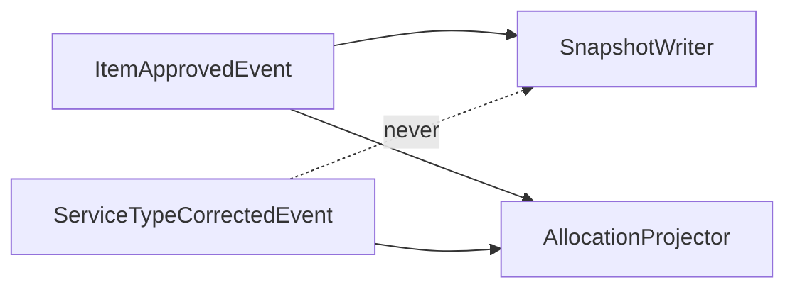

# Worked example: a Defect ticket in the house style

Synthetic. The system, the paths and the figures are invented; the shape is the point. Read it
once for the shape, then read `house-style.md` for why. Everything from the horizontal rule down
is the ticket body as it would be saved; the title is the line in bold above it.

What to notice, in the order a reader meets it:

1. The **title** is a claim with a number, under fifteen words.
2. The **summary** is two sentences of prose: what is wrong, what changes in shape. No steps.
3. The **ask** has its own heading with the owner, immediately after the summary, in a
   blockquote. A reader who stops here knows what is needed from whom.
4. Every `##` after that is an answer to a question. Bold marks the one sentence per section.
5. The figures are a **table**; the paths and the query are in **code fences**; the flow that the
   prose would otherwise have to describe is a **diagram**.
6. The **acceptance criteria** and **out of scope** are visible. The only fold is the raw query
   output, under the answer it supports.

---

**Title:** `SnapshotWriter` skips the fee recompute on 3 of 4 correction paths, leaving 1,504 items stale

`SnapshotWriter` takes the fee figure once, at approval, and only `ApprovalHandler` triggers it.
The three correction handlers rebuild the allocation but never call it, so `line_items.fee_amount`
keeps the figure from the original approval while `allocations.fee_amount` moves. The fix is to
make every correction path recompute the snapshot, then backfill the rows that already diverged.

## Decision needed — Finance lead

> **Which figure is correct for the 1,504 diverged rows: the item snapshot or the allocation?**
> On the flat-fee subset the item matches the expected 10% about four times as often as the
> allocation does (406 vs 106 of 919), so the earlier assumption that the allocation was
> authoritative is recorded here as wrong. 404 rows match neither, which suggests a third defect
> underneath.
>
> Until this is answered, no backfill runs in either direction. The readiness label is off.

## The cause

`SnapshotWriter::write()` is called from exactly one place.

```
app/Handlers/ApprovalHandler.php:88        SnapshotWriter::write($item)   <- the only caller
app/Handlers/ServiceTypeCorrection.php     (no call)
app/Handlers/ServiceDateCorrection.php     (no call)
app/Handlers/QuantityCorrection.php        (no call)
```

Each correction handler emits a `*CorrectedEvent` that `AllocationProjector` consumes and
`SnapshotWriter` does not. **The event already carries the recomputed fee; the writer simply is not
listening.**



## Why it matters

`ClaimBuilder:86` builds the external claim from the **item snapshot**, not the allocation, so
wherever the two disagree the claim follows the stale figure.

| Stage | Claimed externally? | Items | Net delta | Gross delta |
|---|---|---|---|---|
| PAID | yes | 733 | +$20,006.71 | $20,317.61 |
| PAID | no | 624 | −$7,239.89 | $16,623.07 |
| APPROVED | no | 139 | −$3,756.16 | $3,770.56 |
| PAYING | no | 8 | −$196.49 | $196.49 |

**733 rows are already claimed and would need an external adjustment; 771 are not and can be fixed
at source.** Production, read 14 Sep 2026. The claimed/not-claimed split uses
`bills.external_invoice_id` as a proxy and has not been confirmed row by row.

+++ The census query and its output
```sql
SELECT b.stage, b.external_invoice_id IS NOT NULL AS claimed, COUNT(*) AS items,
       SUM(li.fee_amount - al.fee_amount) AS net, SUM(ABS(li.fee_amount - al.fee_amount)) AS gross
FROM line_items li
JOIN allocations al ON al.line_item_id = li.id AND al.status = 'CORRECTED'
JOIN bills b ON b.id = li.bill_id
WHERE li.fee_amount <> al.fee_amount
GROUP BY 1, 2;
```
Four rows as tabled above. A naive join on `allocations.bill_item_id` returns nothing and looks
like a clean result; the real key is `allocations.line_item_id`. Verified against a known
`RECONCILED` allocation as a control before trusting the count.
+++

## The fix

Call `SnapshotWriter::write()` from each correction handler after the projector has run, through
the same `CalculateAllocations` path `ApprovalHandler` uses, so the two figures cannot diverge on
a future correction. Backfill the 771 unclaimed rows once the ask above is answered. The 733
claimed rows are a Finance conversation and their own ticket.

## Acceptance criteria

- [ ] After a service-type correction, `line_items.fee_amount` equals `allocations.fee_amount` for that item
- [ ] After a service-date correction, the same
- [ ] After a quantity correction, the same
- [ ] An approval with no subsequent correction writes the snapshot exactly once
- [ ] Re-running a correction does not change the snapshot a second time
- [ ] The census query above returns zero rows for items corrected after the fix ships

## Deliberately out of scope

The 733 externally claimed rows — needs Finance and an adjustment run, tracked separately. The
even-split defect in `ClaimBuilder:92`, which allocates a claim across allocations by count rather
than by amount; confirmed on live data and worth its own ticket. Any change to the fee model itself.

## Found via

Remediating two bills by hand for an unrelated GST correction. Those seven lines sit inside the
1,504 and were each verified individually, so they are not affected by the open question.
