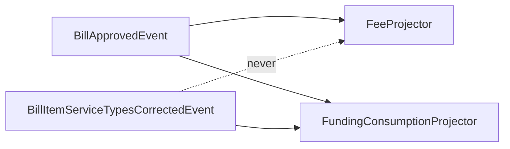

# House style for agent-authored Linear issues

The reader is **an engineer, mid-triage, deciding**. Sometimes a BA; occasionally a product
person, but almost always with an engineer sitting next to them explaining it. Write for the
engineer and the other cases take care of themselves.

They have two questions, in this order: *is this mine, and must I act now?* Then: *do I
understand it well enough to start?* Everything in this document serves those two questions in
that order.

The second reader is an agent, which will ingest the whole thing at no cost. That reader is
why nothing is ever deleted.

## The one rule

**A reader must be able to find the ask, and the shape of the problem, without opening anything.
Everything bulky is folded, and nothing is ever cut.**

Evidence is demoted, never dropped. A ticket that reads as three bullet points has failed just as
badly as a wall of text: the detail is the ticket, and it stays — one click away, in the same
document, where both readers can reach it.

## Why a ticket is not a review

`review-craft` budgets a review body to 150 visible words. **Do not carry that here**, and the
reason is a scar rather than a preference.

That budget was once applied to PR *descriptions*. It cut across the repo's own templates, and
because the detail had nowhere else to go, "shorten" could only be obeyed by paraphrasing.
Paraphrasing silently ate specifics — including a lead about a test file that existed nowhere
else. Seven descriptions had to be restored from GitHub's edit history.

The rule that came out of it: **budget artefacts consumed in a feed; never budget a durable
record.**

> **Corrected 18 September 2026.** This paragraph used to give a second reason — that "a
> description cannot collapse anything". That is false: GitHub renders `<details><summary>` in
> PR bodies and in every kind of comment (probe and citation in
> `review-craft/house-style.md`). The false reason mattered, because it ruled out the one
> mechanism that reconciles complete with short, and left "never budget" to carry the whole
> argument by itself. `review-craft` now budgets a PR description **and** gives the working a
> destination — the author's first PR comment, verbatim. **A budget with a destination is a
> move; a budget without one is a paraphrase machine.** The rule below is unchanged and still
> right for a Linear ticket, where there is no squash commit to protect and folds are native. A review is read once, in a stream, and then is mostly history. A ticket is read once
at speed and then consulted for years — by the implementer, by whoever picks it up after them,
by the person doing the post-incident read, and by every agent that touches the area.

**So there is no word budget anywhere in a ticket.** The first version of this style budgeted the
first screen at about 80 words, and the tickets it produced were the second scar: one flat
paragraph, no headings, the acceptance criteria and the open question folded out of sight, and a
reader who opened every fold looking for what they were meant to do. Short did not make it
legible. Hierarchy does. The budget is replaced by structure, below.

## The title

**A claim, with a number in it where one exists — and short enough to read in the backlog.** The
title is the only part of a ticket most people ever read, because the backlog view is title, label
and state. A title that names a topic makes the reader open the ticket to find out whether it
matters. A title that makes a claim lets them decide without opening it.

```
Good  An empty string silently clears content on 11 write paths
Good  state.json is rewritten on the UI thread every render tick, freezing the app under disk load
Good  pr_seen evicts the newest entries first

Bad   Fix argStr handling
Bad   Investigate performance issue
Bad   Improve the poller
Bad   `app:populate-bill-paid-events` with no bill id zeroes every `monthly_fees` row and re-fires
      `BillMarkedAsPaidEvent` for every paid bill in history; the bulk path is to be removed
```

The three good ones are real, and they are good because you can act on the title alone: you know
what is broken, roughly where, and how much of it there is. The first three bad ones are topics
wearing a title's clothes. The last is a real title this style produced: a claim, with numbers,
and thirty words long. It is the summary paragraph moved into the title field, and it wraps to
three lines in the backlog. **Aim for under fifteen words.** The claim goes in the title; the
sentence that explains it goes in the summary; the decision goes in the ask.

**A number in the title is worth a paragraph in the body.** "11 write paths" tells a triager the
size of the thing before they have read a word of the description.

This is `review-craft`'s "every finding line is a claim, not a topic", moved up one level. It
costs nothing and it is the highest-leverage line in the ticket.

## The skeleton

**Headings are the structure of a ticket. Folds are not.** A reader's eye finds a heading before it
reads a word; it cannot find anything inside a paragraph, and it cannot find anything inside a
collapsed section. A ticket with no headings has one level of hierarchy, and one level is none.

A body opens with a **summary**: what is wrong or what is missing, and what changes, in prose, in
as many sentences as it takes and no more. Then the **ask**, if there is one (next section). Then
`##` headings, each an answer to a question the reader has, in the order they will have them.

The headings are not fixed — see "Sections are answers to questions" — but the ones that recur are:

- **The cause** / **The mechanism.** Why it happens, down to the code path. Named files and methods.
- **Why it matters.** Who is affected and what it costs. The numbers go here, in a table.
- **The fix** / **What changes.** The shape of the change. What the plan delivers, not the steps.
- **Acceptance criteria.** Visible, always. A reader deciding whether to pick this up needs to see
  what done means, and an agent must not have to open a fold to find the contract.
- **Deliberately out of scope.** Visible, always. Publishing what you considered and dropped is what
  earns you the right to keep the rest focused, and it is the section that stops a well-meaning
  implementer expanding the ticket.
- **Alternatives rejected**, each with the reason. The single most valuable section for the next
  person, and the one most often left out.
- **Provenance** / **Found via.** Where this came from, and what it is related to.

**One idea per heading, visibly stated, in bold where one sentence carries the section.** The
reader who scans headings and bold should come away with the argument. The reader who reads the
prose gets the reasoning. The reader who opens the folds gets the proof.

## The ask

**If the ticket needs something from a person — a decision, an answer, a sign-off — that is the most
important thing in it, and it gets its own heading, near the top, with the owner named.** Never a
sentence at the end of the summary. Never inside a fold. Never "one question first" as an
afterthought.

The form is a heading and a blockquote, immediately after the summary:

```markdown
## Decision needed — Patrick

> **Does the bulk path stay?** It has run once in production (5 Jan 2026, 113,977 events).
> If it stays, the reset is scoped to the fees the rebuild repopulates. If it goes, the
> `billId` argument becomes required and the bulk branch is deleted.
>
> Until this is answered the ticket is not ready. The readiness label is off.
```

The heading names the kind of ask (`Decision needed`, `Open question`, `Blocked by`, `Needs
sign-off`) and the owner. The blockquote carries the question in bold, the two or three facts
that bear on it, and what each answer would mean. That is all. The evidence behind those facts is
folded further down and cited from here.

Three asks or more is a spike, not a ticket with questions. Write it as one and say what decision
it unblocks.

A blocker is an ask too: `## Blocked by DAR-547` with one line on what DAR-547 delivers that this
needs. It is also a Linear relation — set both. The relation is what a poller reads; the heading is
what a human reads.

**Readiness is a label, and it is withheld while any ask is open.** See "Use the native fields".

## What folds

A fold is for material a human does not need in order to decide, and an agent needs in order to
build. It costs the human one click and the agent nothing. It is the right place for:

- **Raw evidence.** The call sites with line numbers, the query and its result set, the log lines,
  the reproduction transcript.
- **Method and inputs.** How the numbers were produced, what was pinned, what was not checked.
- **Bulk that supports a section.** A table with forty rows; a census; the full list of files.

It is the wrong place for anything the reader has to know: the ask, the acceptance criteria, the
scope, the plan's shape, the caveats on the figures. **If a section is short enough to read, do not
fold it.** If it is long, keep the answer visible and fold the workings under it:

```markdown
## Why it matters

`GenerateClaimInvoiceItems:86` builds the Services Australia claim from the bill item, not the
consumption, so wherever the two disagree the claim follows the stale figure. **1,504 bill items,
$40,907.73 gross, 733 of them already claimed.**

+++ The census query and the per-stage split
...forty rows...
+++
```

The visible part is the answer. The fold is the proof. A ticket that is only folds has demoted
everything, including the parts that were the point.

## Show it

Linear renders tables, code fences, mermaid, checkboxes, blockquotes and bold. A ticket that uses
none of them is a wall of prose with collapsible sections, and the eye cannot tell what matters.

- **A table** for anything compared or counted: two workflows side by side, figures per cohort,
  what each source says. If the prose has three numbers in a sentence, it is a table.
- **A code fence** for a path, a query, a command, a config line, a quoted error. Copied, never
  described. Inline backticks are for a name in a sentence, not for evidence.
- **Bold** for the one sentence in a section that the reader must not miss. One per section; bold
  everywhere is bold nowhere.
- **A diagram** where the thing being described is a flow, a state machine, a timeline or a
  dependency — anything a reader would otherwise have to reconstruct from prose. Mermaid renders
  natively and is worth drawing when it replaces a paragraph, not when it restates a list. A
  sequence of five writers to one column, the stages a bill passes through, the order two paths
  fire in: draw it. A list of files: do not. One diagram per ticket is usual; two is fine; a
  diagram of the acceptance criteria is decoration.

````markdown

````

None of this is decoration. Each is a way of letting a reader take in a fact without parsing a
sentence, which is the whole legibility problem this style exists to solve.

## Editing a ticket that already exists

**An agent appends. It does not rewrite.** A description is the record of what was known when the
ticket was filed; a decision taken later is a new fact, not a correction to the old one. Rewriting
the body to reflect the decision destroys the question that was asked, the reasoning that led to
it, and the reader's ability to see what changed.

When a decision lands, record it in the ask's own section, dated and attributed, above the original
question:

```markdown
## Decision needed — Patrick

> **Decided, 16 Sep 2026, Patrick:** the bulk path goes. `billId` becomes required.
>
> ~~**Does the bulk path stay?** ...~~
```

Or leave the description alone and put the decision in a comment, then link the comment. Either
keeps the history. Neither rewrites it.

**Never retitle a ticket someone else filed** without saying so in a comment. The title is what
everyone else has been reading and linking.

An agent that finds the plan wrong adds `## Update — <date>` at the top of the plan section with
what it found. It does not silently replace the plan.

## Sections are answers to questions

**No answer, no section.** Cut it.

A fixed template that cannot shrink is a machine for producing unfilled boilerplate, and
unfilled boilerplate is what teaches people that tickets are not worth reading. This is the same
failure a PR template produces when it auto-fills a body that then passes a description check
and fails review.

Never leave a heading with a template prompt under it. Never leave `*(placeholder)*` in a saved
ticket — either fill it, ask the question, or cut the section. A placeholder in a draft is
honest; a placeholder in a saved ticket is a lie about completeness.

## Evidence is never paraphrased

Developers' most-wanted information is the part that is hardest to supply: steps to reproduce,
stack traces, and concrete cases (Bettenburg et al., 466 responses across Apache, Eclipse and
Mozilla). The gap between what a ticket contains and what the implementer needs is an
*information* gap, not a prose gap.

So the expensive part of a ticket is the evidence, and it is the part that must never be
smoothed for readability:

- A path, a line number, a class or a method name is copied, never described.
- A count is a digit. "Several call sites" is not a substitute for "11".
- A production figure carries the environment it came from and the date it was read.
- A quoted error is quoted, not summarised.

If evidence makes the ticket long, fold it. Folding costs the reader one click and the agent
nothing. Rewording it costs everyone the fact.

## Date what was true

A ticket is consulted long after it was written, and agent-authored tickets rot faster than
human ones because they are denser with specifics.

- No bare "currently", "now", "recently", "at the moment", "the latest".
- Production facts carry the date they were read and the environment: *"3,412 rows on prod,
  read 15 Sep 2026"*.
- Version-dependent claims name the version.
- A claim about a file names the file, so a reader can check whether it still says that.

The linter flags the rotting words. It cannot flag a missing date, so that one is on you.

## Acceptance criteria: observable, encoding free

The only hard rule is that a criterion must be **observable and falsifiable**. A "done" you
cannot test is a wish.

- **Gherkin where something executes it.** If QA reads the scenarios verbatim as the test plan,
  Gherkin earns its cost and you should use it. Team FUE works this way.
- **Checkboxes everywhere else.** For a copy change, a config flip or a refactor, a Gherkin
  scenario is ceremony that costs words and buys nothing.
- **Include the negative space.** "Retrying does not create a second bill." "With the flag off,
  nothing changes." The guard cases are where implementations diverge from intent, and they are
  what an agent will otherwise decide for itself.
- **Every criterion has something in the plan that delivers it, and every step exists because of
  a criterion.** A mismatch means one side is wrong. Fix that side rather than papering over it.

A criterion that is really an implementation instruction has been written at the wrong level.
Rewrite it as the behaviour it was reaching for.

## Use the native fields

Linear has `priority`, `estimate`, `labels`, `state`, `cycle`, `project` and relations. They are
filterable, sortable, screen-readable and visible in the backlog view where the decision actually
gets made.

**Do not build a second severity scale in markdown beside them.** A 🔴/🟠 vocabulary in the
description is a second source of truth that will disagree with the priority field, and
disagreement between a field and its prose restatement is a catalogued issue-tracker smell in its
own right.

This is a real difference from `review-craft`, where coloured severity rails earn their place
precisely because GitHub has no severity field. Linear does. Use it.

The same goes for size (`estimate`), ownership (`assignee`), and readiness (a label). A state a
poller can read is worth more than a sentence a human has to interpret — and it is what makes a
ticket dispatchable.

**Readiness is a label, and it is withheld while any question is open.** An unlabelled ticket
with a complete plan is the correct state for "waiting on a decision". Never label a ticket ready
with an open question, a product decision, a production data operation, or an unbounded blast
radius in it.

## Where the solution goes

**In the body, under its own heading. Not in an attachment, and not mixed into the problem
statement.** The shape of the fix is visible; the file-by-file plan, if it is long, is folded
under it.

The argument for an attachment is clean separation: the body stays human, the attachment carries
the agent-grade detail. It is a good argument and it was the alternative seriously considered.
It loses on one point: an attachment is a second thing to open, for the human *and* for the
agent, and every extra fetch is a place where the agent gets a stale copy, gets a 404, or simply
does not bother.

A heading with a fold under it gives the same separation with none of the retrieval risk.
Everything is on the page.

Two rules follow:

- **The summary never contains solution steps.** It says what is wrong and what changes in shape,
  never how. The moment the approach changes, a summary written as steps becomes a lie, and
  nobody edits it.
- **Anything needing a decision is an ask, never a guess written as a step.** A plan with an open
  question is not finished. Write it in the form under "The ask", leave the readiness label off,
  and name who owns it.

## The six shapes

Not templates. Thin adapters on the one contract, each naming what its below-the-fold must carry.
Everything else is cut.

| Shape | Summary says | Sections it must carry |
|---|---|---|
| **Defect** | What is wrong, who it affects, how big | Reproduction, mechanism with the code path, the evidence census, expected vs observed |
| **Change** | What is missing, what will exist after | The plan by file, acceptance criteria, alternatives rejected, out of scope |
| **Spike** | The question, and what decision it unblocks | The options being weighed, what would settle it, the timebox, what a "no answer" outcome means |
| **Record** | What was found and whether anything must be done | The findings, ranked; and what was checked and found sound, so nobody re-checks it |
| **Request** | What is being asked for, and by when | Who asked, the context, what a good answer looks like |
| **Security** | The exposure, in plain terms | Reproduction held to the minimum that proves it, affected surface, mitigation, disclosure state |

Two notes on the less obvious ones.

**Record** is the shape most often written badly, because it is written as though it were a
Change. A ticket that says "seven pre-existing defects, none introduced by this PR" is a record:
its job is to be found later, not to be picked up tomorrow. Its most valuable section is the one
listing what was checked and found *sound* — that is the section that stops the next person
repeating the audit.

**Security** is the one shape where evidence discipline is deliberately reduced. Carry enough to
prove the exposure and no more. A working exploit in a ticket is a liability in a system many
people can read.

## Mechanics

Verified by live probe on **15 September 2026** (DEV-667, DEV-668; both trashed afterwards).

**Folds are native and they round-trip.** Write `+++ Title`, content, then `+++` to close.
Linear also accepts `>>>` as the opener and normalises it to `+++` on save. The fold renders as a
real collapsible section, **collapsed by default**, which is exactly the behaviour this style
depends on.

```markdown
Visible, under a heading.

+++ Evidence: the eleven call sites
Everything in here is folded away by default.
Both readers can still reach it.
+++

Back outside the fold.
```

**An unpaired `+++` swallows the rest of the document.** Everything after an unclosed opener is
pulled into the collapsed section, the API returns success, and nothing warns you. This is the
sharpest failure mode in the whole format and it is why the linter exists. It is the direct
analogue of the unpaired-backtick bug `review_lint.py` catches.

**Verified to survive a human editing the ticket in Linear's own editor.** A ticket written via
the API, then edited by hand in the web editor and saved, came back with both fold pairs intact
and byte-identical. Folds are a first-class node, not a markdown artefact.

**The API serves a stale body for up to about a minute after an editor edit.** Observed: a
read immediately after a hand edit returned the old description with an unchanged `updatedAt`;
the same read a minute later was correct. An agent that reads a ticket right after a human
touched it can get the old text. If a read looks wrong, re-read before concluding the write
failed — and never re-write on the strength of one stale read.

**An issue link expands into a chip carrying the full title.** `[DAR-547](https://linear.app/...)`
renders as a pill with "DAR-547" and the whole title of DAR-547 after it, inline. In prose that is
useful. In a table cell or a blockquote it is not: a five-row table with a linked key in each row
grows a paragraph per row, and a blockquote citing three tickets becomes three lines of other
tickets' titles. Verified 16 Sep 2026 on DAR-566. **In tables and blockquotes, write the bare key
in backticks** (`DAR-547`) and put the link once, in prose or in the Linear relation.

**Linear supports:** tables, mermaid (in a ```mermaid fence or via `/diagram`), checkboxes,
blockquotes, `:emoji:`, code fences, `@` mentions of issues, users and projects, and headings
H1–H4.

**Linear silently drops:** HTML `<details>` (use `+++`), GitHub alert syntax `> [!WARNING]`
(renders as a plain blockquote with the literal text), and HTML generally. The linter flags both.

## What the research supports, and what it does not

Be careful here, because the evidence does not say what we assumed it would.

**It supports:** that the gap between ticket and implementer is an information gap. Steps to
reproduce, stack traces and concrete cases are what developers most want and what reporters find
hardest to supply (Bettenburg et al., 466 responses). Protect the evidence.

**It does not support "long tickets are bad."** An interview study of 26 practitioners against 31
candidate issue-tracker "smells" found "description too long" rated *not* problematic by 6 of 13
respondents, and "no or short description" rated not problematic by 6 of 17. Both were judged
heavily context-dependent — on issue type, team, and workflow stage.

The 14 problems those practitioners actually reported are overwhelmingly system-level:
findability, issue overload, zombie issues, workflow bloat, scoping-is-hard, information islands.
Not one of them is "the prose was dense."

**So state the problem honestly.** The legibility problem this skill addresses is real and it is
*ours*: it is specific to agent-authored density, which is roughly two years old and which nobody
has studied. Do not dress it up as inherited best practice. What the literature does tell us is
that findability and scoping matter more than we were treating them — which is the argument for
the claim-title and the native fields, and against the elaborate template.

## The measurement

Every quality claim in this document is currently an opinion, and the way that argument ends is
with a number rather than with taste.

The metric to build: **how many questions did the implementer have to ask back that the ticket
should have answered?**

It is the ticket analogue of the standard `review-craft` holds itself to — Google's under-10%
effective false positive rate, where a finding nobody acts on counts against you. Here, a ticket
that has to be interrogated before work can start has failed, however complete it looked.

Agents make this cheaper to measure than it has ever been: an agent that stops to ask is a logged
event. Count them per ticket, and the disagreement about format becomes a disagreement about a
number.

**Build this early.** The PR-review work went weeks arguing about taste because it was built
late, and that was the single thing that retrospective said it would change.

## Before you save, check

1. Would the **title alone** let someone in the backlog decide whether to open it? Does it carry
   a number? Is it under about fifteen words?
2. Does the **summary** say what is wrong and what changes, in prose, without steps?
3. If anything is needed from a person, is it under its own **heading near the top, with the owner
   named** — not a sentence at the end of a paragraph, not inside a fold?
4. Does the body have **headings**, and could a reader get the argument from the headings and the
   bold alone?
5. Are the **acceptance criteria** and **out of scope** visible, not folded?
6. Is every fold **raw evidence, method or bulk** — and is the answer it supports visible above it?
7. Is anything compared or counted still in prose that should be a **table**? Any path, query or
   error described rather than in a **code fence**? Any flow or sequence that a **diagram** would
   carry better?
8. Is every section an **answer to a question**? Cut the ones that are not.
9. Is any **path, count, figure or error** paraphrased rather than copied?
10. Does every production fact carry its **environment and its date**? Any bare "currently"?
11. Is every **fold paired**, and does every fold have a title?
12. Are the **acceptance criteria observable**, and do they include the negative space?
13. Are **priority, estimate and labels** set — rather than described in prose?
14. If an ask is open, is the readiness label **off**?
15. If you are editing an existing ticket: did you **append**, dated, rather than rewrite?
16. Has the linter passed?

## Sources

- Bettenburg, Just, Schröter, Weiss, Premraj and Zimmermann, *What Makes a Good Bug Report?*
  (FSE 2008) — 466 responses across Apache, Eclipse and Mozilla; the information-mismatch finding.
- Montgomery, Lüders, Rahe and Maalej, *Smells Depend on the Context: An Interview Study of Issue
  Tracking Problems and Smells in Practice* (ACM TOSEM; arXiv 2601.04124) — 26 practitioners, 31
  smells, 14 problems; the context-dependence finding and the system-level problem list.
- `review-craft/house-style.md` in this plugin — the Google effective-false-positive standard,
  the demote-don't-delete principle, and the PR-description budget scar.
- Live probe of Linear's renderer and API, 15 September 2026, recorded under "Mechanics".
