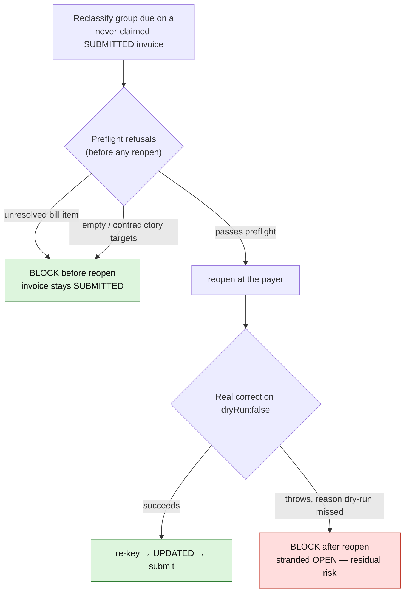

# House style for agent-authored reviews and PR bodies

The reader is a senior engineer mid-task who will **skim first**. Your job is to make the skim
land accurately, and to make the depth reachable in one click for the moment they choose to go in.

Accuracy is not the problem — a correct review nobody reads has failed anyway.

**The standard we hold ourselves to** is Google's, from *Software Engineering at Google* (CACM 2018):
under **10% effective false positives**, where "an issue is an effective false positive if developers
did not take some positive action after seeing it." A finding that is true, and that nobody acts on,
counts against you. "But it was correct" is not a defence.

For calibration: human reviewers run at 64–68% usefulness across ~1.5M comments (Bosu et al., 2015),
so one in three human comments already misses. And attention decays with **position**, not time —
a defect's odds of being caught fall 64% when its file sits last (arXiv 2208.04259). What goes first
matters more than what goes in.

## The one rule

**The body tells the story; the findings live on the code; only proof is folded away.** Nothing is
ever deleted — evidence is demoted, not dropped. A review that reads as a list of bare assertions has
over-corrected just as badly as a wall of text: the reasoning is the review, and it stays visible.

**Budget: 150 visible words in the body. Hard ceiling 400, whatever the size of the diff.**

For scale, measured across the market in 2026: Devin ships 26 words, Qodo 189, Ellipsis 218,
Sourcery 654 (half boilerplate), and Graphite Diamond ships no top-level body at all. A 1,918-word
body is about 3× the longest any commercial reviewer ships.

**The body is triage, not the review.** Findings belong **inline, on the line they concern** —
Diamond, Bugbot and Devin are inline-only. The body says how many, how bad, and the one thing that
matters most.

**At most three findings raised in the body.** Qodo ships `num_max_findings = 3` as a literal
default, and measured tools raise 1.1–3.4 findings per PR. Anything past three goes inline only,
or into a collapsed "Also found" list. If everything is important, nothing is.

## Whose name is on it

- **Self-review on our own PR** — an agent pre-review, like Greptile's. It carries the
  `🤖 Agent review` header and the `agent:<KEY>/<mode>` marker on every comment.
- **A review of someone else's PR** — this is **your principal's review**, posted only after they
  approve it in the session. No agent header and no marker unless they ask for one. The style below
  still applies: it is a house style, not a bot signature.

## Shape of a review: the body is an index, the findings live on the code

Do not rebuild in markdown what GitHub already does. **Each finding is an inline thread on the line
it concerns.** The review body is a short index that links to them. This buys three things we were
faking: the argument sits beside the code it is about, each finding gets its own **Resolve
conversation** so progressive disclosure is native, and the resolution state becomes the tracker
instead of prose claiming something was fixed.

The body runs in the order a reader thinks — decide, then act, then audit:

```markdown
🤖 **Agent review · round N** · `agent:<KEY>/<mode>`
Reviewer: <traits> · <backend> · reviewed <sha-short>

**2 Blockers · 5 Should · 5 Nits — 10 fixed, 2 open.** <The one sentence that matters most.>

**Method** · read <what you read> · ran <what you ran> · **N suppressed** · **N not verified** ·
**N areas not reviewed** — detail at the end

### Problem fit
<2–3 sentences: the problem as you understand it, and whether this change is the right shape for it.>

### Open — needs a decision
| | Where | Finding | Disposition |
|---|---|---|---|
| 🔴 Blocker · pre-existing | [`ProviderWebhookClient.ts:63`](link-to-thread) | `RequestRecorder` persists the bearer token when `RECORD_REQUESTS` is on | Open |
| 🟠 Should · in diff | [`ReconcilePlansCommand.ts:88`](link-to-thread) | Retry budget is shared across flags | Declined — <reason> |

### Resolved in this PR
| | Where | Finding | Fixed in |
|---|---|---|---|
| 🟠 Should · in diff | [`ReconcilePlansCommand.ts:104`](link-to-thread) | Webhook URL reached Sentry breadcrumbs | `3bcbe55` |

<details><summary>How this review was made — scope, suppressed findings, what I could not verify</summary>
… provenance: what was checked and held, Suppressed (N, with reasons), Not verified, how to reproduce …
</details>
```

A **Disposition column on the Open table** gives declined findings a home: a reader may want to
overrule one, but it is not waiting on them, and it should not read as an open question.

The body's word budget **excludes table rows** — they are scan targets, not prose.

**One Method line carries the provenance**, directly under the verdict where the eye already is: what
you read, what you ran, and three counts — suppressed, not verified, and **not reviewed**. The
coverage gap is the most honest number in a review and the one most easily buried; it appears as a
count up here and as a list in the folded block. There is no separate Scope line: two lines of
provenance above the tables is a wall of its own.

**A grouped row or thread declares how many findings it holds, as `×N`** — `⚪ Nit ×5 · mixed`. Without
it the verdict's arithmetic cannot be checked by anyone, including you: five grouped nits counted as
one row is exactly how a verdict line goes wrong.

**A reply still carries the `agent:` marker**, in a trailing `<sub>`. It is not a finding and takes
none of the finding rules, but without the marker a worker's own ticket watcher reports its proof
reply as if a human had commented on the PR.

**`×N` is for findings sharing one thread.** Findings that each have their own thread get their own
row — collapsing three claims behind one link is the conflation the four-part shape exists to undo.

**Replies are not findings.** Moved proof, an answer to the author, a note about a resolution — none
of them take the finding shape, the marker rules, or the budget.

**Two tables, not one.** The first question a reader has is *is there anything for me to do*, and
that is not the same question as *how severe was it*. Open findings demand attention; resolved ones
are record, and cost a skim nothing.

**Tag every finding `in diff` or `pre-existing`.** A reader deciding whether the author must act now
needs that before anything else. A pre-existing blocker surfaced by this PR is important and is not
this author's debt.

**Label a finding that corrects the author's claims**, rather than the code, as `correction`. It is a
different kind of thing from a defect — and it is where these reviews beat a diff scanner.

## Each finding, in its thread

Bold labels inside running prose read as one grey block. Put the finding **inside a GitHub alert**,
which renders a coloured left rail and carries severity before a word is read:

```markdown
> [!WARNING]
> **Should · pre-existing** — `<Tooltip onClick={stop}>` throws on every click · `Open — needs a ticket`
>
> **What** · <one or two sentences of mechanism — what actually goes wrong>
> **Why it matters** · <the consequence, with a number where you have one>
> **What I'd do** · <the action you expect>
>
> <details><summary>Proof</summary>
>
> commands, output, call-site inventory
> </details>

<sub>agent:<KEY>/<mode></sub>
```

Severity picks the alert: **Blocker → `[!CAUTION]`** (red), **Should → `[!WARNING]`** (amber),
**Question → `[!NOTE]`**. Verified rendering: `<details>` works inside the alert, and inside a
blockquote GitHub turns single newlines into `<br>` by itself, so the three labels stay on their own
lines with no trailing spaces. The alert prints its own "Warning" title above your severity word —
mild duplication, accepted, because `Blocker`/`Should`/`Nit` is our vocabulary and it stays
searchable. The `agent:` marker sits **outside** the rail: it is provenance, not finding.

**Disposition goes on the title line as a code span**, not as a fourth label at the bottom. It is
status, and status belongs at the top.

**Nits take a lighter shape — no alert, no labels.** Four labels on a one-line nit is why nits read
as heavy as blockers:

```markdown
⚪ **Nit** — `ToggleGroup` declares a `disabled` prop it never binds · `Fixed in a8f7cc6`
`ToggleGroup.tsx:10` declares it; nothing passes it to `ToggleGroupRoot`. Latent until someone
wires it up, then disabled options show the hand.
**Fix:** bind the prop, and add `data-[disabled]:cursor-not-allowed` to the option slot.
```

The contrast between the two shapes is the point: weight should track severity.

Consistency is the point: once a reader has learned the shape on the first finding, the fourth takes
five seconds. Evidence goes in the thread — ideally as a **reply**, so the proof sits under the claim
it proves, not in an appendix at the other end of the page.

**A grouped thread's budget scales with what it holds** — roughly 250 visible characters per finding
it carries, so five grouped nits at ~1,100 is right, not bloated. Keep a single-finding thread under
**700 visible characters** before the fold — four labelled parts plus a path and
a number do not fit in 400 — and end every comment with the `agent:<KEY>/<mode>` marker.

**A specific outranks the budget.** If trimming to fit would cost a path, a line range or a number,
go over — the four parts exist to carry those, and paraphrasing them away defeats the structure.

**Say who resolved a thread.** A finding raised, fixed and resolved by the same account inside two
minutes reads as theatre, however honest it is. End the comment with "Fixed in `sha` — resolved by
the PR author, not by the reviewer", so the collapse is transparent rather than self-congratulatory.

**Findings raised and fixed before the PR was published** go in the Resolved table, and the verdict
line says so: "6 raised during development and 6 fixed; 2 open" rather than "6 fixed, 2 open", which
implies a reviewer saw them live. Keep a digit against every noun — "all fixed" reads fine and leaves
the arithmetic uncheckable.

**A very long proof goes in a reply, not a nested fold.** Inside an alert the rail extends behind the
fold, so a long `<details>` drags a coloured box a long way down the page. Short proof: nest it.
Long proof: reply with it, and the rail stays the size of the finding. **This is about the rail, not
the budget** — a fold already costs nothing against the budget, so moving proof out will not fix an
over-budget thread. That needs prose trimming, and never at the cost of a path or a number.

**Proof goes in a reply only on threads that stay open.** A resolved thread is already collapsed by
GitHub, so a reply there just doubles the comment count; fold the proof into the comment instead.

**One thread per Blocker and per Should. Nits group** into a single thread with one index row — five
resolved nit threads is noise, and the Volume rule outranks "one thread per finding". **But never
collapse threads that already carry a conversation**: an existing reply from the author is record,
and grouping that destroys it costs more than the noise it saves. Grouping applies to threads you
are about to create.

**Findings with nothing in the diff to anchor to go in one "Corrections and unanchored findings"
comment** on the PR conversation — this is the one top-level comment the post-once rule allows
beyond the index, and the index links to *that comment's* URL. Corrections to the PR
description, a missing ticket, a wrong figure, a CI file the diff never touches — these are often the
most valuable findings and they must stay navigable. An unlinked table row is the last resort, not
the convention.

**Tag `correction` only when it changes what a reader would believe.** In a self-review, correcting
your own description is routine; tagging nine of fifteen findings that way tells the reader nothing.
A wrong figure someone would repeat is a correction; a typo is a Nit.

**A pre-existing finding usually has nothing to anchor to**, because GitHub only anchors inside the
diff. Pin it to the diff line that *triggers* the behaviour, and say in the thread that the code at
fault is elsewhere, naming it. A finding with nothing to pin to at all — a missing ticket, a wrong
figure in the description — stays in the body table with no link.

## Draw the workflow

**When a finding's mechanism is a workflow, draw it beneath the prose.** Five shapes qualify: a
**sequence** where order matters, a **state machine**, a **before/after ordering** the fix changes,
a **transaction boundary**, and a **branching failure mode**. Prose makes the reader rebuild these
in their head, one clause at a time; a flowchart hands them the picture. GitHub renders a
```` ```mermaid ```` fence natively in review bodies, inline threads, comments and PR bodies, so the
cost is a few lines of source.

This comes from one live review, not a census, and it is stated at that strength. Two of its
findings described temporal, branching workflows that were correct and hard to follow. One
flowchart each turned them from a wall of correct prose into something a reader took in at a
glance, and the principal asked for it as standard practice on the strength of it.

**Supplement, never replace.** The four parts stay in full; the diagram goes **directly beneath
the alert**, outside the rail, above the `agent:` marker, and the prose points at it — "the red
path below". A diagram without the prose loses the path, the line and the number a reader needs
to act; prose without the diagram is where you started. Outside the rail for the same reason as
a long proof: inside it, the coloured box grows to the height of the chart. (GitHub's markdown
API emits the same mermaid block inside an alert, inside a `<details>` and at top level, probed
22 September 2026 — so inside is possible, just worse.)

**Before**, the finding alone:

```markdown
> [!WARNING]
> **Should · in diff** — a correction that throws after the reopen strands the invoice OPEN · `Open`
>
> **What** · The preflight now refuses an unresolved bill item and empty or contradictory targets
> before the reopen, so those paths leave the invoice SUBMITTED. The real correction still runs
> after the reopen; if it throws for a reason the dry run missed, the invoice is left OPEN.
> **Why it matters** · …
> **What I'd do** · …
```

**After**, the same finding with this beneath it — and "the red path below" added to **What**:



The fix and the residual risk now sit on one picture: green is what the PR made safe, red is
what it did not. The prose had both; the reader had to assemble them.

**Don't overdo it.**

- **Only where there is a mechanism.** A single predicate, a wrong constant, a missing include or
  a one-line finding gets no diagram. If the chart would be two boxes and an arrow, the sentence
  was already the picture.
- **One diagram per workflow finding**, in the thread it explains. Never a gallery at the end of
  the body, and never a diagram of the review's own structure.
- **Small.** Aim for a dozen nodes or fewer. A chart that needs scrolling has become the wall of
  prose it replaced.
- **In the body, only under Problem fit** — when the direction argument is itself a workflow. A
  finding's diagram lives on its thread.
- **Nits never get one**, which the lighter nit shape already implies.

**Style for both themes.** GitHub renders mermaid in light and dark, and a custom `fill:` with no
text colour leaves near-white text on a pastel box in dark mode. **Every `classDef` that sets
`fill:` also sets `color:`** — `color:#111` against a light fill reads in both. Let colour carry
meaning only once the words already do: "residual risk" is in the node label, and the red
repeats it for the reader who skims.

**The budget.** In a review, a diagram costs nothing: `review_lint.py` excludes mermaid fences
from both the body's word count and a thread's character budget, because a diagram is read as a
picture, and the ~700 characters of source above would otherwise spend a single-finding thread's
entire 700-character allowance. **A PR description is different** — its diagram is copied into
the squash commit — and is covered under "A diagram in a PR body costs its source".

## Mechanics

Posting is two steps, because a link to a thread needs the thread to exist:

1. **Create the threads** — one per finding. Build a JSON payload and use `--input`:
   ```bash
   jq -n --arg sha "$SHA" --arg path "$P" --arg body "$(cat finding.md)" \
     '{commit_id:$sha, path:$path, line:42, side:"RIGHT", body:$body}' > t.json
   gh api repos/OWNER/REPO/pulls/N/comments --input t.json
   ```
   **`-f body=@finding.md` does not work.** `-f` is a literal string field, so the file path posts as
   text. `-F` expands `@`, and `--input` is safer still for bodies with newlines and backticks.
   Keep each returned `html_url`.
2. **Replace the body** with the index, each table row linking to its thread's `html_url`:
   `gh api -X PUT repos/OWNER/REPO/pulls/N/reviews/<review_id> --input body.json`.
   A submitted review body is updated with **PUT**, not PATCH. Inline comments are
   `PATCH repos/OWNER/REPO/pulls/comments/<comment_id>`.
   **Check the rendered HTML, not the markdown you sent.** `gh api -H "Accept: application/vnd.github.html+json"`
   returns `body_html`, so whether a fold survived a blockquote or three labels collapsed into one
   paragraph is checkable from the terminal rather than by eye.

   **Read back what you posted.** The failure is silent: a bad body field returns HTTP 201 with a
   perfectly valid comment containing the wrong text. The cheap check is the response body's length —
   146 characters where you sent 1,200 is the tell, without a second API call.

   Note: every `pulls/N/comments` POST creates a body-less review container, so the REST review count
   climbs even though the UI renders them as threads. That is expected; the index is still one body.

**This section is about self-reviews**, where the reviewer and the author are the same session. On
someone else's PR, the author resolving your thread is them acting on feedback — normal
collaboration, and none of your business to prevent.

**Resolve sparingly, and never before a human has read the review.** Collapse is for things the
reader has already processed; resolving your own threads at post time hides the reasoning before
anyone has seen it, and on a self-review it makes the whole review look pre-agreed. So:

- **Resolve at post time only** findings that were raised *and* fixed before the PR was published —
  nobody was ever waiting on those, and the Resolved table already carries them.
- **Leave everything else open** until your principal has read it. They resolve, or tell you to.
- **On a small review — five threads or fewer — resolve nothing before the first read.** Collapse
  exists to manage noise, and four threads are not noisy. The publication-timing exception is a
  permission, not an instruction: use it only where collapsing actually buys the reader something.
- **A mixed thread is open.** If one thread collects sites found across several rounds — some before
  publication, some after — it stays open. A reader who has not seen the later finding should not
  find it collapsed.
- **Never resolve a grouped thread** that holds several findings — one collapse hiding five findings
  is the worst case of this.
- If leaving them open makes the page noisy, that is a **volume signal**, not a collapse problem:
  raise fewer findings.

To resolve once that point is reached:

```bash
gh api graphql -f query='mutation($id:ID!){resolveReviewThread(input:{threadId:$id}){thread{isResolved}}}' -f id=<thread-node-id>
```

Thread node ids come from `repository.pullRequest.reviewThreads` in GraphQL.

**Anchors do not work in a review body.** GitHub emits no `id` attributes there — headings included —
so a `#user-content-…` link is always dead. Write "detail at the end" in plain text instead.

**Count from the tables, every time.** The verdict line's numbers are the first thing a skimmer takes
on trust and the easiest thing to get wrong: a grouped row holding five nits counts as five findings,
not one. Recount against the rendered tables before posting, and recount again after any edit that
adds or moves a row.

**Post after CI is green.** A review that lands while checks are still running gets read twice.

## Vocabulary

Four severities, Title Case, never invented mid-review:

| | Means | Evidence needed |
|---|---|---|
| 🔴 **Blocker** | Merging causes wrong behaviour, data loss, or a security or authorisation hole | Reproduction, or the exact code path |
| 🟠 **Should** | A real defect or risk, bounded; merging is defensible if it's ticketed | The mechanism, and why it's bounded |
| ⚪ **Nit** | Readability or consistency. The author may ignore it without replying | None |
| 🔵 **Question** | You genuinely cannot determine it and need the author's knowledge | Say what you checked first |

A Question is not a finding in disguise. If you know it's wrong, say it's wrong.

**Direction findings.** When the change is the wrong shape for the problem — a patch on a symptom,
a schema that will need changing again, a workaround for something fixable upstream — say so in
**Problem fit**, not as a Nit at the bottom. If it should block, make it a Blocker and say what you
would build instead.

## Casing and formatting

- **Sentence case headings**: "Problem fit", "Not verified". Not "problem fit", not Title Case.
- Bold **only** severity labels and the one-sentence verdict. Bold inside a paragraph stops working
  when everything is bold.
- Backticks for every identifier, path and value. `file.ts:68`, linked to the line where you can.
- Numbers, not adjectives: "1 in 81 draws", not "quite likely".
- No emoji beyond the four severity glyphs and the 🤖 header. **The word carries the severity, not
  the glyph** — emoji-only schemes (Devin) and image badges (Greptile) can't be searched, filtered or
  read by a screen reader.
- No confidence score. Only one of nine tools prints one, and a score the reader cannot interrogate
  gets ignored — as Greptile's does here.

## Reach for these before prose

- **Suggested changes.** For anything mechanical, a ```suggestion block is a one-click fix and
  replaces three sentences of explanation. Use it for every Nit that has an obvious edit.
- **Mermaid**, beneath any finding whose mechanism is a workflow — see "Draw the workflow" below.
  A diagram of two boxes is noise.
- **GitHub alerts** (`> [!WARNING]`) for at most one thing per review — the one a merger must not miss.

## Rounds: post once

The dominant complaint about AI reviewers in 2026 is not nitpicking — it is that they are stateless
and staggered: they repeat findings the author already rejected, and dribble new comments across
every push. No benchmark measures this, because precision and recall are single-shot.

- **Never re-raise a finding the author declined.** Keep the list of what was rejected, and treat a
  rejection as settled unless the code changes underneath it.
- **One comment per round**, after the push settles — not one per finding as you notice them.
- A re-review says what changed: what's fixed, what's still open, what's new. Nothing else is re-posted.

## "Not verified" is the only section with no adversary

Every other part of a review is checked by someone: findings by the author, severities by the
reader, arithmetic by the linter. The provenance block is checked by nobody, which makes it the
one place where costume survives indefinitely — caveats that sound rigorous and cost nothing.

**The test: a "not verified" item must name something that, if you checked it and it came out
badly, would change a finding's severity or remove a finding entirely.** If nothing it could
reveal would change the review, it is not a caveat; it is a hedge, and it is taking up the space
where a real one should be.

Two ways it goes wrong, both observed in a real review:

- **The caveat about untouched territory.** "The comparison was reasoned about, not exercised
  against the database driver" — where the operation in question never reaches a driver. It
  reads as honest and forecloses nothing. Often it has been carried over from an earlier review
  where it *was* load-bearing, which is why it survives a reread: it was true somewhere else.
- **The caveat that raises confidence instead of lowering it.** "The figure is empirical, so the
  analytic value is the one I would defend." That does not admit a weakness; it promotes a number
  the review never checked, in the section whose job is to admit weaknesses. If a derivation and
  a measurement disagree, the disagreement is the finding — compute it rather than choosing a
  side, because two numbers that agree to one significant figure is exactly where a real error
  hides.

**Where you got something wrong and fixed it before posting, say which way it was wrong.** "The
figure I first derived made the bug look rarer than it is" tells a reader how to weight the rest
of your numbers. "Corrected an error" tells them nothing.

## Volume

No format survives 24 findings on a cursor change. Before a finding goes anywhere, ask the question
the Google standard asks: **will the author take an action?** If not, it belongs in Suppressed with
a reason, not in a thread. Raising fewer findings is what makes the ones you raise legible.

## PR descriptions: the description is the record, the working is a comment

A PR description is **the record of the decision**, and in a repo that squash-merges with
`PR_BODY` as the commit message it *is* the commit message. Write it for the person who runs
`git log` in two years, not for the person who wants to see your homework.

It carries five things and stops:

| | |
|---|---|
| **Why** | the problem, and why it was worth changing |
| **What changed, in shape** | not a file list — what is now true that was not |
| **What a reviewer should look at** | the two or three places judgement is needed |
| **Risks** | what could go wrong, and what would show it |
| **References** | the ticket, the PRs it depends on, the decision record it implements |

Everything else — the evidence census, the production queries and their output, the method, the
alternatives you rejected, the investigation transcript — is **the working**, and the working goes
into **a comment on the PR whose first line is the heading `## Working notes`**, complete and
verbatim. The description links to it in one line:

```markdown
Working notes: <link to the comment headed "Working notes">
```

**Identify that comment by its heading, never by its position.** It is tempting to say "the first
comment", and it is wrong: the working is moved out of the body once the PR has been open a while,
so its comment is the *newest*, not the first. On PR A — the first description written to this
convention — it was the seventh comment, three days after the other six, behind a ticket link-back,
two CI bot reports and two agent review rounds. A rule that said "first comment"
would have failed the one PR that followed it. `pr_lint.py` matches the heading on the comment's
first line for the same reason.

**Nothing is deleted. It moves.** The comment is not a summary of the working; it is the working,
with the paths, the counts, the raw query output and the dates copied rather than described. If
you find yourself paraphrasing to make something fit, you have moved the wrong thing.

### Why a comment is the right home

- **It never enters the squash commit.** GitHub's squash message is the PR title, a blank line,
  and the body **verbatim** — every character, markup included. Comments are not in it. Measured
  on a live squash-merged PR, 18 September 2026: body 4,216 characters, squash commit message
  4,241 characters, one parent.
- **Both readers reach it.** A human scrolls to it; an agent gets it from
  `gh api repos/OWNER/REPO/issues/N/comments` in the same breath as the body.
- **It can be amended.** A commit message cannot. When the census is re-run and the numbers move,
  the comment is edited and the history stays honest — which is exactly what a durable record
  needs and a commit message cannot give you.

### The budget, and why a budget is allowed here at all

**Body length: `min(4000, max(800, 12 × changed lines))` RAW characters of the body as stored,
excluding the Claude Code attribution footer.**

**Raw, not "visible" — and that word is load-bearing.** The squash copies the body verbatim, so
every table pipe, every link target, every `<details>` tag and everything folded inside one is
copied into the commit where nothing renders and nothing collapses. It is also the unit the three
constants below were measured in: they come from `(.body|length)` over the reference
repository's PRs, raw stored characters. An earlier draft of `pr_lint.py` derived the constants from raw bodies and then
checked them against a markup-stripped count, which made the effective budget about a quarter
looser than anything that had been measured. "Visible" is the wrong word here and it cost one
author real ambiguity: writing PR A's description to it, they landed at 958 raw against 797
"visible" and could not tell which number the rule meant.

The one exclusion is the **Claude Code attribution footer**, about 64 characters an author is
required to carry and cannot remove. Charging that to their budget charges them for a tool.

(`review_lint.py` *does* strip markup, and is right to. A review body is read on a page; it is
never copied into a commit. Different artefact, different unit.)

`changed lines` is `additions + deletions` — `gh pr diff <n> --stat | tail -1`, or
`gh api repos/OWNER/REPO/pulls/N --jq '.additions + .deletions'`.

**The reference repository.** The constants below are measurements, not preferences, and a
measurement needs a population. Theirs is a private production monorepo of 5,557 pull requests
that squash-merges with the PR body as the commit message — the case this whole section is about.
It is not named here and its PRs are labelled A–M, because **this skill ships to many repositories
and must carry none of them in its head.** What travels is the method and the numbers: re-run
`(.body|length)` over your own repository and you will get your own, which is the point. If they
differ sharply from these, trust yours.

Three constants, each measured on 18 September 2026 rather than chosen:

- **Slope 12.** Across 45 recently-merged human-authored PRs, the median description runs
  **10.6 characters per changed line**. Twelve is that median, rounded up. The budget is not an
  austerity measure; it is what the people in that repository already write.
- **Ceiling 4,000.** Across all 5,557 PRs in its history the body length distribution is
  p25 662, p50 1,330, p75 2,224, p90 4,208. A 4,000-character ceiling sits at about the 89th
  percentile: it forbids almost nothing the repo has ever routinely done. 4,000 characters is
  also roughly 55 lines wrapped at 72 columns — already a long commit message.
- **Floor 800.** Just above p25, and about eleven wrapped lines. Five sections need room; a
  budget that squeezes a one-line fix's *reason* out of existence is the old mistake again.

**The linear term governs small diffs and the ceiling governs everything else.** That is not a
flaw in the formula, it is the shape of the problem: the worst case measured was not a large
change with a long description, it was **PR A — 17,638 characters of description for 50 changed
lines, one of them application code and 44 of them test.** Twenty-two times its budget.

The census that forced this rule, measured 18 September 2026 across twelve agent-authored PRs
merged over three days. Every one has **zero folds**:

| PR | Changed lines | Body chars | Budget | Over by |
|---|---|---|---|---|
| A | 50 | 17,638 | 800 | 22× |
| B | 148 | 17,943 | 1,776 | 10× |
| C | 222 | 9,271 | 2,664 | 3× |
| D | 786 | 12,780 | 4,000 | 3× |
| E | 1,615 | 22,568 | 4,000 | 6× |
| F | 2,542 | 29,881 | 4,000 | 7× |
| G | 2,849 | 27,789 | 4,000 | 7× |
| H | 2,991 | 38,634 | 4,000 | 10× |
| I | 3,047 | 36,538 | 4,000 | 9× |
| J | 3,284 | 36,703 | 4,000 | 9× |
| K | 6,942 | 24,699 | 4,000 | 6× |
| L | 25,594 | 32,467 | 4,000 | 8× |

**307,000 characters of description across twelve commits, against a budget of 41,000.** A human
reviewer raised it, which is the only reason it was counted at all.

*(Every figure above was read from the GitHub API on 18 September 2026. PR A's description was
rewritten later the same day, down to 959 characters; the 17,638 is in that PR's edit history, not
on the PR. The other eleven were unchanged at the time of writing. A census is a measurement with
a timestamp, and this one has both.)*

**Say it plainly where it is tight.** Among the 45 *recent* human PRs the median body is 4,887
characters — above the ceiling. The ceiling is drawn from that repository's whole history, not
from last month, so some human authors will find it tight too, and that is a deliberate judgement rather
than an accident of arithmetic. If it turns out to be wrong, it is wrong by a measurable amount
and the census above is how you would show it.

### A worked description

PR A is the first description written to this rule, on 18 September 2026. It went from **17,638
characters to 959** — and nothing was lost: the census, the queries and the method moved verbatim
into a comment headed `## Working notes`, the seventh comment on that PR, not the first.

It uses its repository's own bugfix **template** headings rather than the five nouns above, which
is the point — **the five things are what a description carries, not the headings it must carry
them under.** Write to the template; its sections are usually these things wearing local names.

The change below is invented and the domain names with it, for the same reason the worked review
in `examples/` invents its codebase: **the shape is the lesson, and a shape does not need somebody
else's production data to teach it.** The character counts are real.

```markdown
## Summary

**Issue:** the zero-rate exemption in `CalculateOrderSurchargeAction` never fired.
**Root cause:** it compared the band against `'Priority'`, the display label; the name is
`'Priority handling'`.
**Fix:** compare against `SurchargeBand::PRIORITY_HANDLING`, as both sibling resolvers do.
Fixture rebuilt on it; negative test that the label stays chargeable.

## Reviewer focus areas

Now live on a money path; moves no money today — 0 of 28,206 priority `surcharges` rows carry
>0%, and no priority `default_surcharge_rates` row exists (production, 15 Sep 2026).

## Security impact

None; the exemption only gets stricter.

## Related

`TICKET-543` · follow-ups `TICKET-606`, `TICKET-607`
Working notes: the comment titled Working notes.
```

Two things to copy from it. **Every claim carries its number and its date** — "0 of 28,206 rows
(production, 15 Sep 2026)", not "no rows are affected"; that survives becoming a commit message
read in two years. And **the reviewer-focus section states the blast radius rather than pointing
at files**: what a reviewer needs is that this is now on a money path, not a list of what changed.
Both survive the anonymisation, which is the test of whether they were ever about the domain.

At 894 raw characters against a floor of 800 it sits about 1.1× over, which `pr_lint.py` reports
as a warning rather than an error. That is the warning band doing its job: the overage is a
production count and a date, and a specific outranks the budget.

(894 is the *budgeted* figure. The body as stored is 959 characters; the 65-character Claude Code
attribution footer is excluded, for the reason given above. Both numbers are right and they are
not the same number — if you are reconciling a lint run against this page, that is why.)

### The budget is a target, and the linter now says so

**Under 2× the budget finding is a `WARN`. At 2× or more it is an `ERROR`.** That threshold is in
`pr_lint.py` as `BUDGET_ERROR_MULTIPLE`, and it is stated here because an author who cannot see it
has to guess whether the rule means *get under 800* or *get close to 800*. Those are different
instructions and only one of them is right.

The right one is **get close**. The budget is where a description should gravitate, not a line to
shave specifics against. If trimming to fit would cost a path, a line range, a count or a date,
**go over and say why in the body** — that escape is not a loophole in the rule, it is the rule,
and it is now the text the linter itself prints in the warning band.

**Why 2× and not tighter.** The threshold was 1.25× until 20 September 2026, which put an `ERROR`
*below* the level the people using this rule call acceptable — a 1,200-character body for a small
diff is 1.5×, and a 5,000-character description that genuinely earned its place is 1.25× of the
ceiling. Both are fine by the standard this section is trying to encode. Both failed the check.

Loosening it costs nothing the rule was built to catch, and that is checkable rather than hopeful:
**the twelve-PR census above runs 3× to 22×. Every one of them is still an `ERROR` at 2×**, with
margin on the closest. Nothing real has ever been measured between 1.25× and 3×. What lives in
that gap is not bloated descriptions; it is careful ones — #9309 at 1.1× and #9284 at 1.2×, each
one specific away from a red check.

**What did not change.** The formula, the three constants, the raw-character unit, and the move.
The measurement was never the problem and is the valuable part: it is what turned #9284 from
12,340 characters for 29 changed lines into 944, with nothing deleted. Only the point at which the
tool stops advising and starts blocking has moved.

**The floor is the next thing to re-measure, not to guess at.** Two reference links — a ticket and
a working-notes permalink — are ~145 raw characters before a word of prose, 18% of an 800-char
floor, and the two descriptions actually written to this rule both land near 950. That is a real
signal that 800 may be drawn low for a body carrying mandatory links. It is not a reason to start
excluding link targets from the count: the squash copies targets verbatim into a commit message
where nothing renders them, "raw, not visible" is the correction that cost an author a day of
ambiguity, and unlike the attribution footer — which an author is required to carry and cannot
remove — *which* links a description carries is a choice. If the floor is wrong it is wrong by a
measurable amount, and the method is the one used for the original three constants: p25 of
`(.body|length)` over the repo's history, restricted to bodies carrying a ticket link.

### Write to the repository's template, and let the linter find it

**A PR template is not a suggestion and a description is not a blank page.** Where a repository
ships templates, they exist because somebody decided what a description *there* has to carry —
and that decision usually encodes things an author drafting from scratch will not think of: the
rollback line, the security sentence, the reference someone needs in a year. A description that is
merely *shorter* than its template is fine. One that is *unrecognisable* from it is not shorter,
it is different, and the repository has lost the thing it standardised on.

So: **find the template, fill it, and add to it freely.** Extra headings are never a fault — a
template is a floor, not a cage. **Keep its shape and make the prose inside it tighter; that is
what the budget is for.** Cut a section only when it genuinely does not apply, and when you do,
say so in a line rather than deleting the heading. Because of the exemption below, keeping a short
section costs you nothing at all.

If you are drafting a description and the repository has a template convention, **use it rather
than inventing your own shape.** A house shape you invented is one more thing for a reader to
learn, and it is not yours to choose.

`pr_lint.py` finds templates two ways, and **the difference decides the severity**:

| | | |
|---|---|---|
| **Supplied** | `--template PATH` (a file, or a directory of them) | an assertion that this *is* the shape here → drift is an **`ERROR`** |
| **Discovered** | walked from conventional paths | an inference — the repo never said it was mandatory → drift is a **`WARN`** |
| **Neither** | no templates found | **no finding at all** |

That rule is the whole policy, and it deliberately contains no opinion about any particular
repository. **Severity follows the strength of the claim.** An agent that has been told which
template applies passes `--template` and gets a hard check; a linter that merely guessed gives
advice. `--require-template` promotes a discovered template to `ERROR`, `--template-advisory`
demotes a supplied one to `WARN`, for the caller who knows better than either default.

The discovery order:

```
.github/PULL_REQUEST_TEMPLATE/      docs/pr-templates/      docs/pr_templates/
.github/pr-templates/               .github/pull_request_template.md
pull_request_template.md            docs/pull_request_template.md
.github/PULL_REQUEST_TEMPLATE.md
```

The three GitHub auto-fill paths are there because most repositories use them. But **a repository
that wants a new PR body to arrive empty has to keep its templates somewhere GitHub does not
recognise** — an auto-filled body means untouched boilerplate is not an empty body, so a
"description present" check passes while the author has written nothing. Repositories that have
worked that out are exactly the ones with a considered template convention, which is why the list
looks past GitHub's conventions instead of assuming they are the whole story.

**The third row matters as much as the first two.** A repository with no templates gets no finding
whatsoever. This skill runs wherever it is installed, and inventing a convention for a repository
that has none would be the most annoying possible way to be wrong.

### The budget charges the sections that explode, not the ones that must not be trimmed

The budget was a flat count over the whole body, and that was wrong in a specific way: it charged
the author for the sections that are short by nature and expensive to lose. Two reference links
are ~145 raw characters before a word of prose — 18% of an 800-character floor — and the same
count fell on the security sentence and on the rollback line somebody reads during an incident.
Shaving any of those to reach a character count is the rule doing harm.

**These sections carry free**, matched as case-insensitive substrings of the heading: `Related`,
`References`, `Links`, `Security impact`, `Security`, `Deployment`, `Rollback`. What is budgeted is
the narrative — the summary, the reviewer notes, the testing story — which is where a description
actually explodes.

**That list is the intersection of what templates commonly ask for, not a closed set.** Your
template will have sections it does not name. Pass them:

```bash
python3 pr_lint.py --repo OWNER/REPO --pr 42 \
  --template docs/pr-templates/bugfix.md \
  --exempt-section "compliance" --exempt-section "on-call runbook"
```

`--exempt-section` is repeatable and **adds** to the defaults; `--no-default-exempt` discards them
and uses only what you passed; `--exempt-cap N` moves the ceiling. The agent drafting the
description is the one that knows which sections its template treats as fixed overhead, so it is
the one that should say.

**But the exemption is for fixed overhead, not a hiding place.** Past **750 raw characters** a
single exempt section starts counting again, so `## Related` cannot quietly become the new body.
750 is p90 of **226 such sections measured across 99 live PR bodies in the reference repository on
20 September 2026** — p50 263, p75 473, p90 728, p95 1,018, max 1,634 — rounded up. Nine in ten
real ones pass free; an outlier is carrying something that is not a reference. The linter prints
the credit and shows the cap biting, e.g. `deployment requirements 750 of 3,009`.

**The check that this does not defang the rule.** Exempting sections *and* raising the error
threshold to 2× are two loosenings stacked, so they were tested together against the twelve-PR
census, under the worst case: every PR claiming the maximum possible credit, four exempt sections
each at the full cap, 3,000 characters free.

**All twelve are still `ERROR`. The closest is C at 2.4×** against a 2.0× threshold — thinner
margin than the 3.2× before the exemption, and still real. If a thirteenth case ever lands between
2.0× and 2.4×, that is the number to revisit, and this is the calculation to redo.

The effect on real descriptions is the point: **PR A goes from 894 characters and 1.1× over to 599
budgeted and comfortably inside**, because its `Security impact` (61 chars) and `Related` (234
chars) stop being charged. Nothing about that description changed. The rule stopped asking it to
delete its references.

*(Re-measured 20 September 2026: eleven of the twelve census PRs have since been rewritten and now
sit between 2,661 and 6,399 characters. The table above is the 18 September measurement and stays
as recorded — a census is a measurement with a timestamp. Anyone re-running it live will get
different numbers and should not conclude the table is wrong; they should conclude the rule
worked. B is the exception, still 17,874 characters at 8.9× budgeted.)*

### Reconciling this with the paraphrase scar

`issue-craft` carries the rule this came from: **budget artefacts consumed in a feed; never
budget a durable record.** That rule is right, and it is not being repealed. It was written after
a 150-word budget was applied to PR descriptions, and the only way to obey "shorten" was to
paraphrase — which silently ate specifics, including a lead about a test file that existed
nowhere else, and seven descriptions had to be restored from GitHub's edit history.

The scar's real lesson was never "descriptions must be long". It was **"there was nowhere for the
detail to go, so shortening destroyed it."** The old guide added a second, false reason —
that a description cannot collapse anything — which ruled out the one mechanism that reconciles
complete with short, and left "never budget" standing alone.

Now there is somewhere for it to go. The working moves to a comment, whole, and the budget
applies to what is left. **A budget with a destination is a move; a budget without one is a
paraphrase machine.** That distinction is the whole fix.

**A specific still outranks the budget.** If trimming to fit would cost a path, a line range, a
count or a date, go over and say why in the body. The five sections exist to carry those.

### `<details>` does fold in a PR body — but use it sparingly there

An earlier version of this guide said a PR description "cannot collapse anything". **That is
false.** GitHub renders `<details><summary>` in PR bodies, issue bodies and every kind of
comment.

**Probed 18 September 2026**, read-only: `cli/cli` PR
[#13318](https://github.com/cli/cli/pull/13318) has four `<details>` blocks in its markdown body,
and `gh api repos/cli/cli/pulls/13318 -H "Accept: application/vnd.github.html+json" --jq .body_html`
returns real `<details>` and `<summary>` elements. On the comment side, a review comment carrying
one `<details>` in its markdown returns one rendered `<details>` in `body_html`, checked the same
way. (The `cli/cli` link stays because it is public and anyone can re-run the probe against it —
that is evidence, not provenance.) GitHub
documents the behaviour at
[Organizing information with collapsed sections](https://docs.github.com/en/get-started/writing-on-github/working-with-advanced-formatting/organizing-information-with-collapsed-sections).

**But a fold in the body is not a place to hide the transcript**, and this is the one thing that
makes a description different from a ticket: **the squash copies the raw tags.** `<details>`,
`<summary>` and the markdown inside them land in the commit message as literal text, where
nothing renders them and nothing collapses them. Folded bulk in a body is still bulk in
`git log`.

So, in a PR body, `<details>` is for **reviewer aids that belong with the commit and would be
noise unfolded** — a short changed-file list, a release checklist, a migration command someone
will need again. Anything you fold there, you are choosing to keep in the commit message.
Everything else goes to the comment.

**A folded block counts against the budget in full**, tags and all, because the squash copies it
in full. That is the opposite of how folds work in a review body or a Linear ticket, and it is the
single most important thing to carry across: in a PR body, folding is a courtesy to the reader on
the page and buys you nothing in `git log`. Keep folds in the body few and short.

### A diagram in a PR body costs its source

A diagram earns a place under *What changed, in shape* when the change **is** a workflow — a new
state, a reordered sequence, a moved transaction boundary. Everywhere else, the rules in "Draw the
workflow" apply unchanged.

**What changes is the budget. A mermaid fence counts in full**, for the same reason a fold does:
the squash copies the source into the commit, where nothing renders it. `pr_lint.py` does not
exempt it, and should not — "raw, not visible" is the unit every constant was measured in, and a
fence is raw characters like any other. The worked diagram above is ~700 characters: most of an
800-character floor on its own.

So, in order:

1. **Keep it compact.** Short labels, few nodes. **Drop the `classDef` lines in a body** — they
   are the part that reads as noise in `git log`, and a body diagram should say what matters in
   its labels anyway. Edge labels read almost like sentences in plain text; styling does not.
2. **If the body is still tight, relocate it**: into the `## Working notes` comment, or into a
   review comment on the line where the workflow lives. Neither touches the body budget, and a
   diagram on the line it explains is usually the better home regardless.
3. **Do not fold it to hide it.** A folded diagram still counts, and still lands in the commit.

## The linters are the gate, not this document

Two live beside this file, and they check different artefacts:

| | Checks | Run it |
|---|---|---|
| `review_lint.py` | a **posted review** — index shape, arithmetic, thread budgets | `python3 review_lint.py <PR> --repo OWNER/REPO` |
| `pr_lint.py` | a **PR description** — the budget for that diff, headings, placeholders, rotting dates, and that the working-notes comment it links to exists | `python3 pr_lint.py --repo OWNER/REPO --pr <N>` |

`pr_lint.py` also lints a local draft, which is how you check a description *before* you open the
PR: `python3 pr_lint.py draft.md --changed-lines 50`. It will not guess the diff size, because a
budget checked against a guessed denominator reports PASS about nothing.

Both are **mechanics only**. A clean run means nothing is broken, not that anything is worth
reading.

`review_lint.py` checks the posted review against these rules —
index shape, method line, table links, verdict arithmetic, severity rails, the four parts,
disposition chips, thread budgets and dead anchors. The description is `pr_lint.py`'s job. It reads
GitHub's rendered HTML rather than the markdown you sent.

**A review is not finished until the linter passes.** Run it, fix what it names, run it again, and
paste the final output when you report. A document nobody can fail is a suggestion; this is the rule.

## Before you post, check

1. Would the first 15 lines, alone, tell a reviewer what to do? (Verdict, problem fit, the open table.)
1b. Does the body read as a story — decide, act, audit — rather than blocks stacked in no order?
2. Is every finding line a claim, not a topic?
3. Does the visible layer fit the budget for this change size?
4. Is anything asserted without a number, a path, or a command behind it?
5. Did you state whether this change is the right shape for the problem — not just whether the diff is correct?
6. For each finding: what action do you expect the author to take? If you can't name one, it belongs
   in Suppressed, not in the review.
7. Does every finding say whether it is `in diff` or `pre-existing`, and carry a disposition?
8. Does every table row link to its thread, and is every fixed thread resolved?
9. Does any finding describe a workflow — a sequence, a state machine, an ordering, a transaction
   boundary, a branching failure — without a diagram beneath it? Does any diagram sit under a
   finding that is really a single predicate?

## Before you call a PR ready, check

1. Does the description carry **why, what changed in shape, what to look at, risks, references** —
   and stop?
2. Is the **working** — evidence, queries and their output, method, alternatives, transcript — in
   a **PR comment headed `## Working notes`**, verbatim, with nothing paraphrased on the way?
3. Does the description **link to that comment in one line**?
4. Is the body inside `min(4000, max(800, 12 × changed lines))` **raw** characters (the
   attribution footer aside), or over it for a named specific you would not paraphrase away?
5. Does every `<details>` in the **body** hold a reviewer aid you are content to see as raw tags in
   `git log` — not the transcript?
6. If the body carries a diagram, is it compact and unstyled — or would it read better on the
   line it explains, off the budget?
7. Has `pr_lint.py` passed against the real PR, not only the draft?

## Sources

The numbers above come from a market scan of nine commercial review tools and the papers cited
inline. The scan itself is not shipped with this skill; the figures that survived it are.

Three pieces of review folklore did not survive tracing, so don't repeat them: the "60-minute
reviewer ceiling" has no primary source; "70–90% defect discovery" appears only in SmartBear
marketing, uncited; and "200–400 LOC" is a distortion of the Cisco study's "under 200, not to
exceed 400", whose upper bound rests on the unsourced 60-minute claim.

## Revision

**18 September 2026.** Until today this guide ruled PR descriptions out of scope, on two reasons.
The first was sound — descriptions follow the repo's templates and are a durable record, so the
150-word review budget must not be carried across to them. The second was false: it said a
description "cannot collapse anything". GitHub renders `<details><summary>` in PR bodies and in
every kind of comment, and the probe is recorded above.

The false reason did the damage. It ruled out the one mechanism that reconciles *complete* with
*short*, so "never budget a durable record" stood alone and was read as "length does not matter".
By 18 September that had produced eleven agent-authored PRs carrying 9,000–39,000 character
descriptions with zero folds — 307,000 characters across twelve commits in a repository that
squash-merges with the PR body as the commit message. The worst, PR A, was 17,638 characters for
50 changed lines, one of application code and 44 of test. A human reviewer flagged it; nothing in
this guide would have.

What replaced it is not a shorter description. It is a **destination**: the description is the
record of the decision and is budgeted against the diff, and the working moves whole into the
author's first PR comment. The paraphrase scar of the original incident is honoured by the move,
not by the absence of a budget — the seven descriptions restored from edit history in that
incident were destroyed by having nowhere to put the detail, which is now fixed.

`pr_lint.py` landed the same day, because a rule with no check is a suggestion.

**Two corrections, the same day, from the first PR actually rewritten to this rule (#9309).**
Both came from an author trying to follow the draft, which is the only way either would have been
found:

1. The draft said the working went in **the author's first comment**. It does not. The working is
   moved out of the body after the PR has been open a while, so its comment is the *newest* — the
   seventh on #9309, three days after the other six. It is identified by the heading
   `## Working notes` on its first line, and the linter matches on that.
2. The draft budgeted **"visible" characters**, which the author read as excluding markdown link
   targets, and could not tell whether their description was 958 or 797. The budget is **raw
   characters of the body as stored**, minus the attribution footer — that is what the squash
   copies, and it is the unit the floor, the slope and the ceiling were all measured in. The
   first `pr_lint.py` checked raw-derived constants against a stripped count, which made the real
   budget about a quarter looser than anything measured.

**20 September 2026.** Two changes, and one correction to how this document is written.

The budget's `ERROR` threshold moved from 1.25× to **2×**, and the budget stopped charging for
reference, security and deployment/rollback sections — both argued above, both re-checked together
against the census. Template fidelity is now checked, with severity following whether the template
was supplied or merely discovered.

The correction is the one worth recording. **This guide had been written against a single named
repository** — its PRs linked by number, its domain names in the worked example, its ticket keys,
and in one place its governance record used to justify a default severity. That is wrong for a
skill that installs anywhere: a reader in another repository cannot open those links, the domain
names taught nothing the invented ones do not, and **a default argued from one repository's policy
is that repository leaking into everyone else's tooling.**

So the measurements stayed and the provenance went. PRs are labelled A–M, the population is
described rather than named, and the worked example's domain is invented on the same principle the
worked review in `examples/` already used. Every number, date and method above is unchanged and
still checkable — against your own repository, which is where it should have been pointed all
along. The rule for anything added here from now on: **if it names somebody's repository, ticket
system or internal policy, it does not belong in this file.**

**22 September 2026.** "Draw the workflow" replaces the old one-line rule of at most one mermaid
diagram per review. That cap was a guess, and the first live evidence ran against it: in a review of
an invoice update engine, two findings each described a branching, temporal workflow, and one
flowchart apiece made them legible where correct prose had not. The rule is now one diagram per
workflow finding, beneath its prose, never instead of it — with the theme rule and the budget
interaction stated. `review_lint.py` stopped counting mermaid source as prose, and stopped failing a
PR description for carrying a diagram, which this file now recommends where the change is a
workflow. `pr_lint.py` is unchanged on purpose: a fence in a body is raw characters in a commit. The same
day, `review_lint.py` dropped its check on the PR description altogether: it failed any description
carrying `<details>`, which this file has permitted since 18 September, and with mermaid gone too it
tested nothing `pr_lint.py` does not already own.
