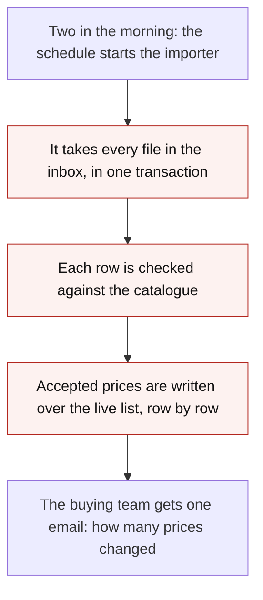
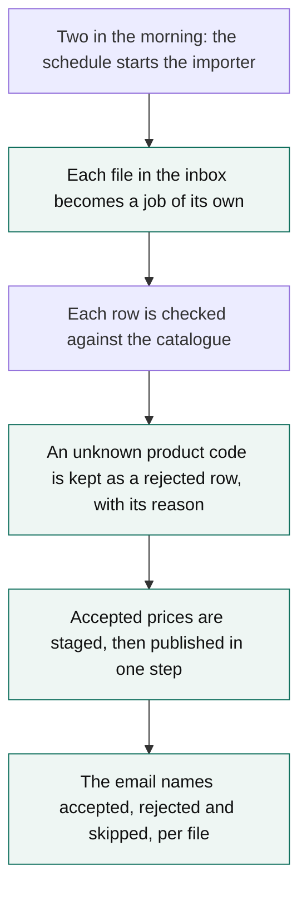

# Understand the change before you review it

**The understanding exists for one purpose: so your principal can be told what is being reviewed
before they open any code.** It is not a warm-up for the findings, and it is not notes for you. It
is the one thing a newcomer to the domain could read and then follow the rest of the review.

Three steps, in this order, and **all three before a test is run or a lens applied**. They are
`workers/review.md`'s steps 2 to 6 and Review Desk's layers 2 to 4; the numbers below are that
brief's, so a worker reading both never has to translate:

| Step | You read | You produce |
|---|---|---|
| Understand | The ticket, the description, and the code **as it was before the change** | The problem first, then the change: a headline, how it works today, a before flow, an after flow, numbered problems, and one line each of was-wrong and now |
| Alternatives | A blind session's options, then the author's | Every option scored against each numbered problem, and who put it forward |
| Solution | The change as a design — not yet as code | The change in parts with their files, the choices the ticket left open, and where the description and the code disagree |

Then you show your principal, short, and only then do you read the diff in depth.

**Why in that order.** An understanding written after the diff argues for the diff. It is worth
nothing to anyone: it cannot tell your principal whether the change is the right shape, because it
was assembled from the shape that was chosen.

**Why this short.** On the review that forced this file the session recorded 310 words of prose and
a 50-line typed sketch, for what the approved layout carries in **85 words and one picture**. The
prose was not wrong. It was unreadable at the speed someone doing ten reviews a day reads at.

---

## Understand — `review.md` step 2

| Slot | What goes in it | Length |
|---|---|---|
| **Headline** | What this change does, and what it buys. Plain enough for someone who has never opened the repository | One sentence, at most 20 words |
| **The problem** | What the change is solving, in plain words. Not the headline, which says what the change *does*, and not the was-wrong lines, which are one per numbered problem | One or two sentences |
| **The system** | What this is, who uses it, what it is for — the context a newcomer needs before any of the rest reads. The same sentences fill the blind brief's `## The system` | Two or three sentences |
| **Supporting table** | One row per question the system answers and who answers it, with a today column and an after column. The column that changes is the point | 3–4 rows |
| **Before** | The flow as it is today, one step per row, each with one line of detail. Numbered problems marked on the rows they sit on | 4–6 rows |
| **After** | The same flow as the change leaves it, with the fixes marked | 4–7 rows |
| **Problems** | What is wrong, numbered. The numbers are used by every later step and never renumbered | 2–4, numbered |
| **Was wrong / now** | Per problem, one line of what was wrong and one line of what it is now | Two lines each, at most 20 words a line |
| **Names** | The classes, files, routes, columns and flags — one level down, behind the fold, never on the top layer | As long as it needs |

The numbers are the spine of the whole review. Alternatives scores options against them, Solution
says which part fixes which, and a finding can say which problem it threatens.

**The whole top layer — the headline plus every was-wrong and now line — is 150 words.** That is a
*budget*, and the per-line numbers above are *caps*: the budget is deliberately tighter than the
sum of them, because four problems at the 20-word cap each way plus a 20-word headline would be
180. A cap stops one line running away; the budget stops the top layer doing it collectively, and
a brief cannot spend every cap at once. The approved board of 10 October 2026 spent 85 of the 150.
`brief_lint.py` names the longest lines when the budget is what failed, not the caps.

**The Supporting table is change-half, and "The system" is not.** The table has an after column,
so the problem-only read a blind pass may be shown leaves it out; "The system" and the Before flow
are in it. So if a table is what it takes to explain how things work **today**, that belongs in the
Before flow or in "The system" — put it in the Supporting table and the one reader who most needs
it is the one who will not see it.

## Alternatives — `review.md` steps 3 and 4

| Slot | What goes in it |
|---|---|
| **Options** | One row per option: a title of at most 12 words, who put it forward (the ticket, the blind pass, or both), and a verdict against each numbered problem — `fixed`, `partly`, `stays`, or `not_assessed` where nobody scored it |
| **Keys** | One capital letter per option. **Keep the letters the ticket already used**, and give an option only the blind pass raised the next free one. Assign them before anything refers to an option and never re-letter: re-sorting the table must not change what C means |
| **For and against** | Per option, the case for it and the case against. **Detail, behind the row, and never length-checked** — depth is allowed here. For an option the blind pass raised, these are its mechanism, its cost, and what it says it assumes |
| **Built** | Which option the author built, and the one line of why |
| **Blind pick** | What the blind session would have picked, and its one line of why |
| **Questions** | What the blind session needed to know and was not told. These are often the best questions in the review |
| **What the pass was given** | The filled brief you handed the blind session, **verbatim**. Not a description of it |
| **Looked up** | What the blind session says it read beyond the brief — the word "nothing", or an honest list |
| **Counts** | How many options each source had, how many are on both, and how many only one side raised |
| **Provenance** | Where the problem statement came from: the ticket, the description, and the code at the base sha |

### The blind options pass

One session, dispatched through **"Independent help"** in `_common.md` — `allele_sessions_create`,
traits different from your own — given the problem and the pre-change code and **nothing else**.
It exists because the author's option list was written by someone who had already decided. On its
first trial it returned 7 options against the ticket's 4; 3 were on both, 4 were not on the ticket,
and its pick matched what was built.

**It is on by default, and no size threshold gates it.** A ten-line change can have catastrophic
consequences. `review.blind_options_pass: false` in the instance config is the only thing that
switches it off, and your dispatch block tells you which way it is set.

**Pin it to the base commit by exporting that commit, not by checking it out.**

```bash
git fetch -q origin                        # the base ref has to be there to merge-base against
base=$(git merge-base "origin/$(gh pr view <n> --json baseRefName --jq .baseRefName)" "<head sha>")
dir=$(mktemp -d)
git archive "$base" | tar -x -C "$dir"     # a tree with no .git in it
```

An export has no history, no branches and no diff in it, so the session cannot reach what was built
even by accident — and "it could not have seen the answer" stops being something you have to take
on trust. Record `$base`; it belongs in the provenance slot. `rm -rf "$dir"` with the discard.

**The leak rule.** The problem statement must not name or lean toward what was built. Use the
Before flow and the numbered problems **as you already wrote them** and add nothing: no class,
table, route or flag the change introduces; no "should"; no ordering that matches the order the
change fixes things in. Read it back and ask whether a careful reader could guess the design from
it. If they could, the pass is already spent — the second weakness of the first trial was exactly
this: its brief was written by a session that knew the answer.

**The brief, as a template.** Fill every angle bracket; delete nothing else.

```markdown
You are being asked for an independent view on a design problem. You get the problem and the code
as it was **before** anyone tried to fix it, and nothing else. Other people have already chosen an
approach. You are deliberately not being told what it was, so that your answer is not shaped by it.

Rules
- Work from this brief and the tree at `<EXPORT DIR>` — this repository at commit `<BASE SHA>`,
  with no history in it. Nothing else: not the ticket, not the pull request, not the branch, no
  `git`, no GitHub, no Linear, no issue tracker, no web search.
- If you do look something else up, **say so in the answer**. We would rather know than guess.
- Do not try to work out what was decided. Lay out the genuine option space.
- Options must be materially different approaches, not variations in naming.
- Change nothing: no commits, no branches, no pull requests, no issues. Write one file, the answer.

## The system
<Two or three sentences a newcomer could follow: what this is, who uses it, what it is for.>

## How it works today
1. <The Before flow, one numbered line per step.>

## What is wrong
1. **<The problem, plain.>** <One or two sentences of mechanism, and the evidence that it bites.>

## What to produce
Write one JSON object to `<ANSWER PATH>`, then reply with one line saying it is written.

{
  "options": [{
    "title": "at most 12 words, plain English",
    "mechanism": "one or two sentences: what would actually be built or changed",
    "fixes": {"1": {"verdict": "fixed | partly | stays", "why": "one short sentence"}},
    "cost": "one sentence: the main cost or risk",
    "assumes": "one sentence: what would have to be true that this brief does not tell you"
  }],
  "pick": {"title": "the option you would choose", "why": "two sentences at most"},
  "questions": ["up to four things you needed to know and were not told, one sentence each"],
  "looked_up": "the word 'nothing', or an honest list of anything you read or ran"
}

Give between four and seven options. Include doing nothing only if it is defensible. Include
options that fix the problems separately as well as together, and at least one that moves the
problem somewhere else rather than fixing it in place.
```

One entry in `fixes` per numbered problem, and **the answer path goes in your own workspace, not
in the export** — the export is thrown away and you still need the file.

**Reclaim it the moment it reports** — `allele_sessions_discard`, then `rm -rf "$dir"`. A helper
left running holds a slot against the global cap.

**If it cannot run, say so once and carry on.** A depth limit, a capacity error that outlives your
retries, or the setting switched off: name it in the provenance slot and in one line to the
Dispatcher, mark every option row as the ticket's, and review the change. A blind pass is worth a
great deal and is worth nothing at all compared to a review that never arrives.

## Solution — `review.md` step 5

| Slot | What goes in it |
|---|---|
| **Parts** | One row per part of the change: what it is, which numbered problems it fixes, its files with lines added and removed, and **whether the pull request changed each file at all** — a part may claim a file outside the diff, which is how a finding in such a file belongs to a part |
| **Choices** | Where the ticket left a choice: what was open, what was chosen, the one line of why, whether it departs from the ticket, and — where one raises it — the finding |
| **Disagreements** | Where the description and the code say different things: what the description says, what the code does, and **the finding that raises it**. That one is required, so raise the finding first: a disagreement nothing raises posts a review that never mentions it |
| **Verdict** | Whether this is the right *shape* for the problem, in a phrase |

Read the change here as a **design**. The question is whether this is the right *shape* for the
problem, not whether it is correct — that is the code review, two steps later. A patch on a
symptom, a schema that will need changing again, or a workaround for something fixable upstream
belongs here and in **Problem fit** at the top of the posted review, never as a nit at the bottom.

A departure from the ticket is not a finding on its own. Say what was chosen and why; if the why
does not hold, *that* is the finding.

## Showing it — `review.md` step 6

One message, before you read the diff in depth: the headline, the two flows, the numbered problems
with their was-and-now lines, the options table, and the parts. Nothing about code quality yet.

**You never ask for it to be confirmed, and you never treat a reply as a sign-off.** Only the
developer signs off, in the dashboard, and your brief gives you no route to one. You are showing
your work so they can correct you early and cheaply — which is most of its value.

---

## Rules that hold across all three steps

**1 · The top layer is plain.** The headline and every was-wrong and now line carry **no class
name, no file path and no `::`**. Routes and other names a newcomer can read may stay. Names go one
level down, under a fold, where someone who wants them will find them.

| | |
|---|---|
| ✗ | `ImportRun::dispatchFiles()` now wraps each file in its own `price_import_rows` transaction instead of one `DB::transaction` in `NightlyImportCommand`. |
| ✓ | Each price file is imported on its own, so one bad file no longer stops the night. |

**2 · A flow is drawn, not typed.** Where the understanding is shown as a diagram it is a
```` ```mermaid ```` fence **that parses**. Check it before you ship it — `mmdc -i f.mmd -o f.svg`,
or GitHub's own preview — because a fence that does not parse renders as a red error box, which is
worse than the prose you started with. Every `classDef` that sets `fill:` also sets `color:`, so it
reads in both themes.

A **hand-drawn text sketch is the failure this replaces**: box-drawing characters and padded
columns, 50 lines of it, which nothing renders, nothing diffs and nobody scans. It is the single
biggest thing the first live review got wrong, and it was 50 lines of effort spent making the
output worse.

**3 · Parallel things are a table.** The characteristic failure is one sentence of three clauses
joined by semicolons — it reads as one long thing, so the reader cannot see that there are three,
and cannot refer to the second one later.

| | |
|---|---|
| ✗ | One bad file rolls back the whole night; a price we cannot match is dropped without a trace; and prices go live while the file is still being read. |
| ✓ | The three rows of the Problems table below, numbered 1, 2 and 3 — each of which an option can fix, a part can own, and a finding can name. |

**4 · Every number is a count you made, not an adjective.** "7 options, 4 of them not on the
ticket" and "28 files, +817 −343". Never "several" or "a large change".

---

## A worked example

Invented, in the shape and at the length a real one runs to. A nightly import of supplier price
lists in a shop's admin.

### Understand

> Each price file is imported on its own and published in one step.

**The problem.** A night's price import is all-or-nothing, and a price we cannot match disappears
without a trace.

**The system.** A shop's admin imports supplier price lists overnight. The buying team sets the
prices and the shop front reads them the next morning; nobody watches the import run.

**Supporting table**

| What decides it | Today | After |
|---|---|---|
| Which files are imported tonight | The importer, by listing the inbox folder | Unchanged |
| What one bad row costs | The whole night — the run rolls back | The file it is in |
| When buyers see a new price | Whenever the writer reaches that row | One moment per file |

**Before**



| | Marked on | |
|---|---|---|
| 1 | the second row | one transaction for every file |
| 2 | the third row | an unknown product code is dropped |
| 3 | the fourth row | prices go live mid-file |

**After**



| | Was wrong | Now |
|---|---|---|
| 1 | One bad file rolled back the whole night, including the files that were fine. | Each file stands or falls on its own. |
| 2 | A price we could not match was dropped without a trace. | It is kept as a rejected row, with the reason and the line it came from. |
| 3 | Prices went live while a file was still being read, so the shop could show half a price list. | A file's prices appear all at once, or not at all. |

<details><summary>By name</summary>

**1 · The one transaction.** `NightlyImportCommand` wrapped the whole folder in a single
`DB::transaction`. A failure anywhere rolled back every file. Now `ImportRun` records the run and
`ImportFile` each file, and `ImportFileJob` carries one file with its own three retries.

**2 · The dropped rows.** `PriceRowValidator` returned `null` for an unknown product code and the
importer skipped it. Now it returns a rejection, written to `price_import_rows` with a reason and a
line number.

**3 · The live write.** `PriceWriter` wrote to `product_prices` as it read. Now it writes to
`staged_prices` and `POST /imports/{file}/publish` moves a whole file across in one statement.
</details>

### Alternatives

| | Option | Seen by | 1 | 2 | 3 |
|---|---|---|---|---|---|
| **C** | **One job per file, staged and published in one step** · built | Ticket · Blind | fixed | fixed | fixed |
| **B** | Keep one run, but commit after each file | Ticket · Blind | fixed | stays | partly |
| **E** | Validate a whole file before any of it is written | Blind | partly | partly | fixed |
| **F** | Import into a copy of the price list and swap the two | Blind | stays | stays | fixed |
| **D** | Write rejected rows to the run's log file | Ticket | stays | fixed | stays |
| **G** | Let the supplier's system send us one product at a time | Blind | fixed | fixed | fixed |
| **A** | Keep today's shape and retry a bad night by hand | Ticket · Blind | stays | stays | stays |

| | |
|---|---|
| **Built** | **C.** One job per file, staged and published in one step. Agreed on the ticket before work started, and the most work of the four there. |
| **The blind pass would pick** | **C**, the same one. "It is the cheapest option that fixes all three, and a file is the unit the supplier already thinks in." |
| **Given** | The poured problem half, verbatim — the fold below is the whole of it. |
| **Looked up** | Nothing. |
| **Counts** | 4 options on the ticket, 6 from the blind pass, 3 on both; 3 not on the ticket and 1 the blind pass never raised. |
| **Provenance** | The ticket, the description, and the code at `a1b2c3d` — an export with no history in it. |

<details><summary>What the pass was given, verbatim</summary>

```markdown
## The system
A shop's admin imports supplier price lists overnight. The buying team sets the prices and the
shop front reads them the next morning; nobody watches the import run.

## How it works today
1. Two in the morning: the schedule starts the importer
2. It takes every file in the inbox, in one transaction
3. Each row is checked against the catalogue
4. Accepted prices are written over the live list, row by row
5. The buying team gets one email: how many prices changed

## What is wrong
1. **One bad file rolled back the whole night, including the files that were fine.**
2. **A price we could not match was dropped without a trace.**
3. **Prices went live while a file was still being read.**
```
</details>

<details><summary>For and against — all seven carry them; three are shown</summary>

**C · built.** *For:* a file is the unit the supplier sends, the buyer thinks in and the retry
needs, so one job per file makes every later question answerable. *Against:* a staging table and
a publish step are new moving parts, and the night's run is no longer one thing to look at.

**B.** *For:* two lines in the existing command, and tonight's good files survive a bad one.
*Against:* a half-written price list is still visible mid-run, which is problem 3 untouched.

**E.** *For:* nothing is written until the whole file is known to be good. *Against:* a file is
read twice, and one bad row still costs the file — which may be the right trade, and the ticket
never says.

*A, B, D, F and G carry theirs too.* The record requires a case each way on **every** option —
a brief missing one is refused — and three are shown here only to keep the example short.
</details>

What the blind pass needed and was not told:

- How often is a whole file rejected — nightly, or twice a year?
- May a supplier send the same file twice, and what should the second one do?
- Must a price change be visible the same night, or is the next morning enough?

### Solution

| Part | Fixes | Files |
|---|---|---|
| A record of each import run, and each file in it | 1 | 3 · +180 −0 |
| The supplier onboarding note, which the import contradicts | 2 | 1 · outside the diff |
| One job per file, with its own retries | 1 | 2 · +96 −40 |
| Rejected rows, with a reason and a line number | 2 | 3 · +120 −0 |
| A staging table for accepted prices | 3 | 2 · +64 −0 |
| The publish step, one file at a time | 3 | 2 · +75 −12 |
| The summary email, rewritten, and its tests | 2 | 4 · +210 −96 |

| The ticket left open | Chosen | Why | Against the ticket |
|---|---|---|---|
| Where a staged price lives | A table of its own | The publish becomes one statement | Left open |
| A file that is half rejected | Its accepted rows publish | The buyer wants the good prices tonight | **Departs.** Needs your call |
| Who retries a failed file | The job, three times | Nothing in the ticket says | Left open |

| | The description says | The code does |
|---|---|---|
| F2 | A rejected row is retried the next night | Rejected rows are never read again |
| F5 | Publishing a file is one transaction | The swap and its audit row are two |

**Verdict.** The right shape: a file is the unit everything downstream already uses.

---

## Where this lands in the posted review

**Problem fit keeps its 2–3 sentences.** The understanding is for your principal, not for the pull
request: what reaches GitHub is the headline, whether the change is the right shape, and nothing
else. It **may** carry the before-and-after diagram beneath it: `review_lint.py` homes a body diagram
under Problem fit or under a finding and **warns** on one anywhere else, and a diagram costs
nothing at all against a review's word budget — mermaid is stripped before the words are counted.

**Check it before you show it.** `brief_lint.py` in this skill reads a brief — the document you
are about to `review-desk brief put`, or the one it already holds — and fails on the mechanical
shapes this page argues against: a headline that is a paragraph, a flow that is not drawn, a
numbered problem no box carries, a class name on the top layer, three clauses joined by
semicolons, and every length limit in the tables above. It needs no `review-desk` to read a file,
so it runs before the brief is saved. The limits are this file's; `--limits` prints them with
their provenance, and **this file is where they are changed**.

**With Review Desk**, every slot above has a field of its own: the headline, both flows, the
numbered problems with their was-and-now lines, the options with a verdict per problem and who
proposed each, the blind pass, the parts, the choices and the disagreements.
`workers/review.md`'s "With Review Desk" owns which field, which of its two brief writes each
slot lands in, and who is asked to confirm it. The field names are there and not here, so there
is one copy of them.

## Revision

**10 October 2026 (second change).** `brief_lint.py` arrived and enforces the limits in the tables
above. Two of them were proposed looser in DEV-884 — 5 numbered problems and 8 rows in a flow —
and this file won both, because one fact has one owner and the slots are stated here. The
headline's slot read "under 20 words" against DEV-884's 25; Patrick ruled on 10 October 2026 that
it is **at most 20**, which is what it now says and what the linter checks, so Review Desk's
real-length brief passes on all eighteen rules. The options slot's "under 12 words" is read the
same way and is checked. The 150-word total and the 20-word line limit both stand, and the
paragraph above says why the first is tighter than eight of the second. The linter reports what it
measured either way, so a number that turns out to be wrong is visible rather than argued.

**10 October 2026.** New file. The three understanding steps moved ahead of the tests and the
lenses in `workers/review.md`, and what each one produces is written down here with a blind
options pass between the first two.

**10 October 2026, later.** "Where this lands in the posted review" listed `problem`, `diagram`
and the counts in `provenance`, which was the whole of what a brief could hold before DEV-882.
Every slot has a field now, and the names live in `workers/review.md` so there is one copy.

Then the slots were reconciled against that record, so none of them has to be improvised.
**"How it works today" named two different things** — a paragraph of plain words and a 3–4 row
table — which are two fields, and the problem-only read carries the first and not the second. They
are **"The system"** and **"Supporting table"** now, with a line saying why a table about today
belongs in the Before flow rather than the second one. Seven slots were added for fields the record
requires and nothing produced: **The problem**, **Keys**, **For and against**, **What the pass was
given**, the outside-the-diff column on **Parts**, the finding on **Choices** and
**Disagreements**, and **Verdict**. And the verdict words are the record's — `fixed`, `partly`,
`stays`, `not_assessed` — in the tables, in the worked example and in the blind brief's own JSON,
which used to say `yes | partly | no`: one vocabulary end to end beats a mapping nobody can see
being applied.
